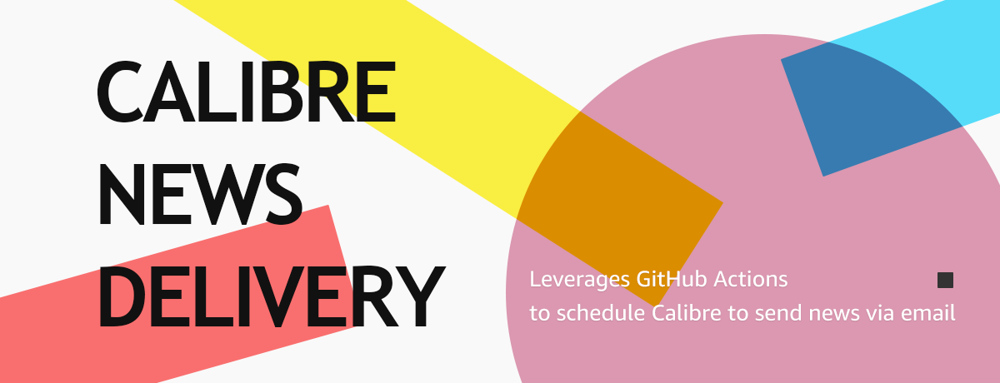

__English__ · [简体中文](README.zh-CN.md)

---

# Calibre News Delivery



Leverages GitHub Actions to schedule Calibre to send news via email.

## Shortcut

 __[Upload Recipe](../../upload/master)__ | __[Add Built-in Recipe](../../edit/master/recipe_list.txt)__ | __[Update Schedule](../../edit/master/.github/workflows/calibre-news.yml)__ | __[Workflow](../../actions/workflows/calibre-news.yml)__ | __[Environments](../../settings/environments)__ | [Enable/Disable](../../settings/actions) | [Destroy](../../settings#danger-zone)

## Setup

1) Create a project using the __[use this template]__ button located in the top right corner.
2) Navigate to [ [Settings](../../settings) > __[Environments](../../settings/environments)__ ] in your project.
3) Click "__New environment__" to create a new environment named `calibre-news`.
4) Add the required "__environment secrets__" to the environment as follows.

|Name|Required|Description|Example|
|---|---|---|---|
|FROM|Yes|Your email address|xxx@gmail.com|
|TO|Yes|Destination email address|xxx@kindle.com|
|ENCRYPT|Yes|SMTP encryption method|SSL|
|SECRET|Yes|SMTP password|xxxxxxxxxx|
|SMTP|Yes|SMTP server|smtp.gmail.com|
|PORT|Yes|SMTP port|465|
|FORMAT|No|The ebook format (default is epub)|epub|
|SIZE|No|Attachment size limit (default is 25MB)|25|
|DAYS|No|Ebooks retention period (default is 90 days)|90|

5) Navigate to "__[Actions](../../actions)__" and click [ __Calibre News Delivery__ > __Run workflow__ ] to test.

Normally, you may receive two example ebooks sent from your project.

> [!TIP]
> 📹 A Brief Tour Video: [https://youtu.be/sIFsoztF58A](https://youtu.be/sIFsoztF58A)

## Schedule

The default delivery is scheduled to occur daily at midnight (00:00) UTC. You can change it according to your preference. The cron expression `- cron: '0 0 * * *'` can be found in the workflow file located at:

```
/.github/workflows/calibre-news.yml
```

Please refer to the "__[schedule](https://docs.github.com/en/actions/using-workflows/events-that-trigger-workflows#schedule)__" documentation to specify an appropriate time. For example, if you are in a timezone that is UTC+8 and want the delivery to start at 6:00 AM every day, you can set the cron expression as `0 22 * * *`, calculated using the formula `UTC Time = Local Time − Offset`.

Additionally, you can manually trigger the delivery on the "__[Actions](../../actions)__" page of your project.

## Recipe

For the built-in recipes, you need to add their titles (found in the `Title` attribute of the recipe file) to the plain text file __[recipe_list.txt](recipe_list.txt)__, one title per line. For manually written recipes, simply place them in the root of the project.

You can specify the cover and style for a recipe. Place the cover image in the "__covers__" folder and the style file in the "__styles__" folder. Both filenames must match the corresponding recipe title or filename. Be aware that the style may be ignored by the Send to Kindle service.

You can upload the recipe files using either the Git tool or GitHub's online uploading feature. The best practice is to test the recipe locally to ensure no errors occur before uploading it.

## Storage

All converted ebooks will be zipped together and stored in the Artifacts of GitHub Actions. You can find and download them in the job details of each workflow record. Each file will be retained for up to 90 days from the date it is generated.

You can change the retention period in the "__[Artifact and log retention](../../settings/actions#retention-header)__" section on the Actions settings page. You can also do this through the environment settings (refer to the [Setup](#setup) section).

Be aware that files exceeding the size limit for email attachments will not be sent via SMTP. You will need to download them manually from the Artifacts.

## Notice

This project does not accept any PRs for adding recipes. Please do something interesting on your own.

## Links

* [API documentation for recipes](https://manual.calibre-ebook.com/news_recipe.html)
* [Calibre recipe repository](https://github.com/kovidgoyal/calibre/tree/master/recipes)
* [Adding your favorite news website](https://manual.calibre-ebook.com/news.html)

## License

[GNU General Public License v3.0](LICENSE)
